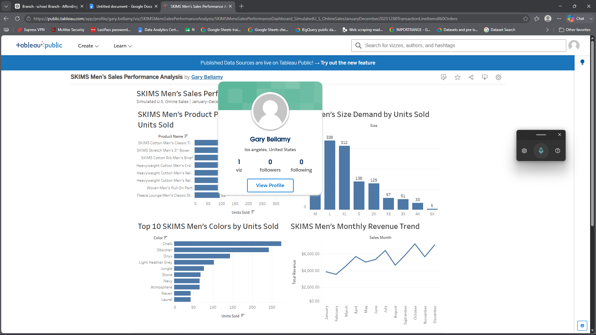

# SKIMS Men’s Sales Performance Analysis

Business analytics portfolio project analyzing simulated SKIMS men’s retail sales to identify product performance, color and size demand, and monthly sales trends.

> **Data Note:** Transaction-level sales data used in this project is simulated for educational and portfolio purposes and does not represent actual SKIMS internal sales data.

## Project Overview

This project analyzes simulated U.S. online sales for eight SKIMS men’s products from January through December 2025. The goal was to translate transaction-level sales data into actionable insights that could support inventory, merchandising, and marketing decisions.

## Business Questions

1. Which products sold the most units and generated the most revenue?
2. Which colors were the most popular?
3. Which sizes had the highest demand?
4. Which months performed the best?

## Tools

- Python
- SQL
- BigQuery
- Google Sheets
- Tableau
- Jupyter Notebook

## Dataset

The simulated dataset contains:

- 1,200 transaction line items
- 860 unique orders
- 1,415 units sold
- $65,108 in simulated revenue
- 8 SKIMS men’s products
- January–December 2025 sales activity

## Key Findings

- The SKIMS Cotton Men’s Classic T-Shirt ranked first with **291 units sold** and **$12,804 in simulated revenue**.
- Chalk was the highest-demand color with **274 units sold**, followed by Obsidian with **242 units**.
- Medium had the highest size demand with **352 units sold**, followed by Large with **338** and XL with **312**.
- October generated the highest simulated revenue at **$7,234**, while December recorded the highest order and unit volume.

## Recommendations

- Prioritize availability of high-performing core products such as the Classic T-Shirt.
- Maintain strong availability of high-demand neutral colors.
- Allocate greater inventory toward M–XL while continuing to monitor the full size range.
- Prepare inventory and marketing activity ahead of strong fourth-quarter demand periods.

## Project Structure

- [`1_Project_Planning`](1_Project_Planning/) — Business problem, objective, scope, and business questions.
- [`2_Dataset`](2_Dataset/) — Simulated datasets, Python generation files, workbook, and data-quality checks.
- [`3_SQL_Queries`](3_SQL_Queries/) — BigQuery SQL analysis for product, color, size, and monthly performance.
- [`4_Visualizations`](4_Visualizations/) — Tableau dashboard and individual visualizations.
- [`5_Final_Report`](5_Final_Report/) — Final stakeholder report with findings and recommendations.

## Tableau Dashboard

[View Interactive Tableau Dashboard](https://public.tableau.com/views/SKIMSMensSalesPerformanceAnalysis/SKIMSMensSalesPerformanceDashboard_SimulatedU_S_OnlineSalesJanuaryDecember20251200TransactionLineItems860Orders?:language=en-US&:sid=&:redirect=auth&:display_count=n&:origin=viz_share_link)

[View Final Report](5_Final_Report/YOUR_FINAL_REPORT_FILENAME.pdf)
## Analysis Workflow

Planning → Data Generation → Data Validation → BigQuery / SQL Analysis → Tableau Visualization → Business Recommendations

## Project Disclaimer

This project was created for educational and portfolio purposes. Publicly available SKIMS product information was used for product details, while transaction-level sales data was simulated in Python. Results do not represent actual SKIMS sales, customers, revenue, or inventory.
